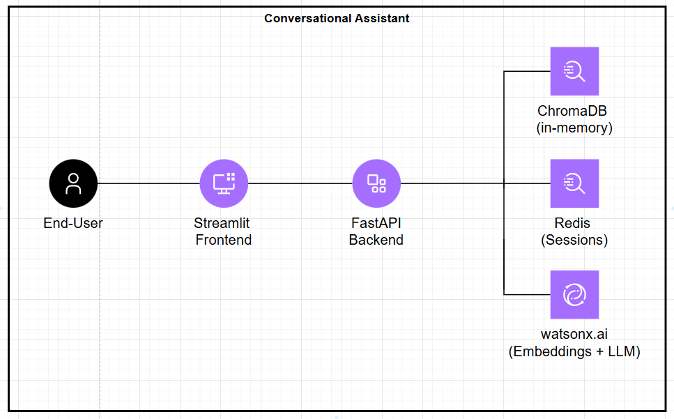

# Watsonx.ai - RAG Assistant Challenge


## Index


- [1. Introduction](#1-introduction)
  - [1.1. About INCA Solutions](#11-about-inca-solutions)
  - [1.2. Business Challenge](#12-business-challenge)
- [2. Installation](#2-installation)
  - [2.1. Prerequisites](#21-prerequisites)
  - [2.2. Environment variables](#22-environment-variables)
  - [2.3. Build and run the assistant](#23-build-and-run-the-assistant)
- [3. Technical decisions and architecture explanation](#3-technical-decisions-and-architecture-explanation)
  - [3.1. Application Architecture](#31-application-architecture)
  - [3.2. Repository Structure](#32-repository-structure)
  - [3.3. Technical decisions](#33-technical-decisions)
  - [3.4. Integration details for IBM Watsonx.ai](#34-integration-details-for-ibm-watsonxai)
- [4. Future Work](#4-future-work)


---


## 1. Introduction


Watsonx.ai - RAG Assistant Challenge is an MVP of a RAG-based (Retrieval-Augmented Generation) conversational assistant that uses IBM Watsonx.ai to generate embeddings, perform inference, and optionally apply re-ranking—all while retrieving answers strictly from the provided documentation (Unleashing the Power of AI with IBM watsonx.ai).
This MVP aims to demonstrate how Watsonx.ai can be used to explain and support itself, effectively becoming a self-referential tool for onboarding and internal enablement. This solution will serve as a proof of concept to validate the feasibility of deploying Watsonx.ai internally to empower technical and non-technical users alike.


---


## 2. Installation


### 2.1. Prerequisites


- Docker or Docker Desktop installed.
- Local environment capable of running containers.
- Access to IBM Watsonx.ai.
- Python 3.12.


### 2.2. Environment variables


Environment variables are dynamic values that can be stored and used by different processes on an Operative System (OS). They allow for values to be defined externally, without having to access the application's source code.


The application's environment variables are the following, and should be introduced in a `.env` file. See [`.example.env`](/source/back-end/.example.env) for an example.


- `WATSONX_URL`. Secrets Manager instance URL.
- `WATSONX_PROJECT_ID`. Secrets Project Unique Identifier.
- `WATSONX_APIKEY`. Secrets Manager instance API Key.


### 2.3. Build and run the assistant.


To build the the assistant you should first run:
  ```bash
  docker-compose build --no-cache
  ```
To run the assistant after it was built, you can run:
  ```bash
  docker-compose up
  ```
To stop the assistant after it was built, you can run:
  ```bash
  docker-compose down
  ```


Ensure that the ports 6379, 8000 and 8501 are free to use, or change the assigned ports for the application in the `docker-compose.yml` file.


The application will be accessible in [http://localhost:8501/](http://localhost:8501/)


## 3. Technical decisions and architecture explanation.


### 3.1. Application Architecture





The solution following flow:


1. A user asks a question about Watsonx.ai.
2. The system generates embeddings of the question using **IBM Watsonx.ai**.
3. A semantic search is performed on a vector database containing indexed documentation.
4. The system prompt for the language model is enhanced with the most similar questions, and the most similar documentation context segments.  
5. The selected context and few shot examples are passed to a language model hosted on **Watsonx.ai** to generate the answer.
6. The answer is returned to the user via the front-end. The chat history is preserved for future questions.


---


### 3.2. Repository Structure


The repository structure was kept as provided, and no subdirectory was used.
```
.
├── assets/               # Documentation Assets
├── images/               # Images used in the present document
├── source/               # Application source code
│   ├── back-end/         # Backend
│   └── front-end/        # Frontend
└── README.md             # Present document
```


### 3.3. Technical decisions


**System Architecture and Infrastructure Decisions**


1. Backend: The backend was developed in Python using FastAPI's package.
2. Frontend: The frontend was developed in Python using Streamlit's package.
3. Vector Database: ChromaDB was used for the vector database, as an in-memory solution.
4. Sessioning: Redis was used as the solution to handle multiple sessions.
5. The dotenv package was used to load sensible environment variables.
6. For containerization, a Dockerfile was placed in the backend folder, and another one in the frontend folder. The docker-compose file builds both images, loads the redis image, and creates the docker network, ensuring that all components run inside docker containers.


**NLP Pipeline and User Interaction Design Decisions**


1. The chosen language model used for embedding generation is `intfloat/multilingual-e5-large`. This decision was made because out of the Watsonx.ai language models for embedding catalog, this one is the highest ranked one in the MTEB benchmark.
2. The chosen language model for text generation is `meta-llama/llama-3-3-70b-instruct`. This decision was made due to the authors familiarity of the model.
3. The decision to create a small QA corpus was made due to the fact that few shot prompting is benefitted from semantically closer examples to the actual question that the model needs to answer. The answers in the corpus always include the section from which the answer was extracted for better guidance.
4. The chat history was created so that the user can only see his questions and the answers instead of the contextualization. This was made to improve readability, and ease of use.
5. The ensurance that the model will answer solely based on the Watsonx.ai documentation was done by using a system prompt that guides the model to avoid hallucinating.
6. The chunking strategy uses overlapping segments of maximum token size.


**Security Decisions**
1. The usage of HTTP instead of HTTPS was made due to the understanding that the implementation of HTTPS was out of the scope of the MVP. The data that was deemed sensible for the scope of the application, and the communication with the frontend is just the `chat history` which while it should remain private for each session it is not considered of critical importance.


### 3.4. Integration details for IBM Watsonx.ai


The IBM Watsonx.ai integration was done using the Python ibm_watsonx_ai package, starting by loading the credentials, which were defined in the environment variables and loaded using dotenv, to later define the credentials variable. Once the credentials were defined, the communications with the watsonx.ai embeddings foundational models was done via the foundation_models subpackage from the ibm_watsonx_ai package.
For the LLM inference, using IBM foundational models, the communication was done in a similar way by first defining the credentials, and latter using the ModelInference subpackage from the ibm_watsonx_ai package.


## 4. Future Work.


**Priority Tasks**
For further improvement of this MVP, the most important pending tasks that should be investigated and implemented are the following:
1. Use an LLM as a judge for hallucination avoidance, and ensurance that the answers that are provided are based on the ground truth document.
2. Implement the usage of HTTPS to ensure the privacy of each session's chat history.
3. Improve the chunking strategy by first separating the document segments by sections, and retrieving the whole section when a chunk of a given section is identified as semantically similar to a user's question.


**Extra Improvements**
Taking a step further, the Assistant could be improved by:
1. Generating a QA (Question Answering) corpus and fine tuning the model, for better question answer alignment.
2. Adding a FAQ (Frequently Asked Questions) to the frontend.


---
